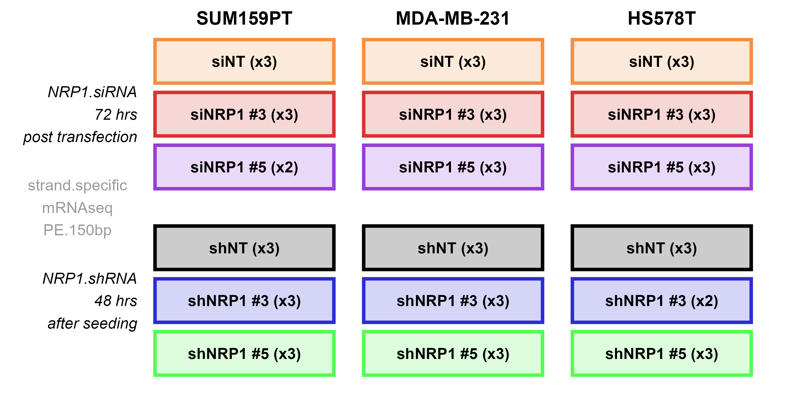

# GSE266566_NRP1_KD_BrCa_llynam
This bulk mRNA-seq dataset is available for download from the NCBI Gene Expression Omnibus under GEO accession number [GSE266566](https://www.ncbi.nlm.nih.gov/geo/query/acc.cgi?acc=GSE266566).
It comprises 52 samples in total, derived from the 3 claudin-low breast cancer cell lines HS578T, MDA-MB-231 and SUM159PT. For each model, NRP1 (Neuropilin 1) was knocked down using 2 siRNA and 2 shRNA sequences, as well as the non-targeting control RNAs, respectively. Two to three independent biological replicates (2 outlier samples were removed during data quality control) are provided for each treatment condition, resulting in 17-18 samples per cell line. 

The scripts provided are for processing the GSE266566 data files and generating the figures in our SDATA-24-03470 paper.
